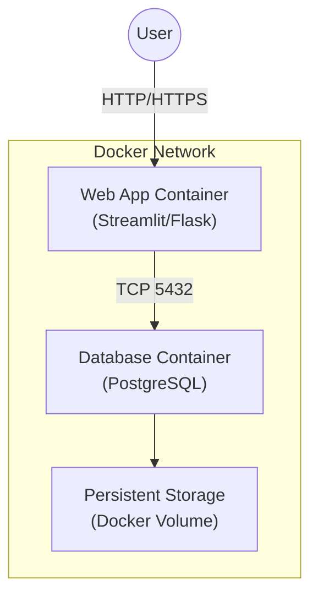
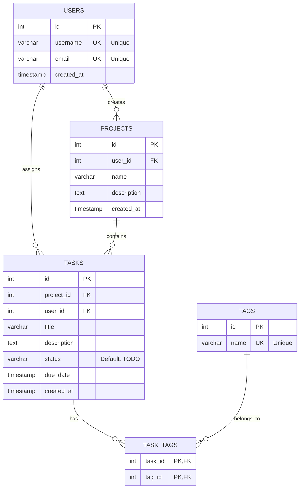

# システム設計書

## 1. システム構成図 (Architect Role)

本アプリケーション「Task Memo App」の推奨システムアーキテクチャを以下に示します。
コンテナ技術（Docker）を活用し、ポータビリティと開発効率を高めた構成とします。

### アーキテクチャ概要
- **Frontend / Application Server**: Python (Streamlit または Flask)
- **Database Server**: PostgreSQL
- **Infrastructure**: Docker Compose によるオーケストレーション

### 構成図 (Mermaid)



### コンポーネント詳細
1.  **Web App Container**:
    *   役割: ユーザーインターフェースの提供、ビジネスロジックの実行。
    *   技術スタック: Python, Streamlit/Flask, psycopg2 (DBドライバ)。
    *   機能: タスクの表示、作成、編集、削除、ステータス管理。

2.  **Database Container**:
    *   役割: データの永続化。
    *   技術スタック: PostgreSQL 15+。
    *   設定: データの整合性を保つための制約、インデックス、トランザクション管理。

---

## 2. データベース設計 (Infra/DB Role)

タスク管理システムの信頼性と拡張性を担保するためのデータベース設計を行います。

### ER図 (Entity Relationship Diagram)



### テーブル定義 (主キー、外部キー、制約)

#### 1. `users` (ユーザー)
*   **PK**: `id` (SERIAL)
*   **制約**:
    *   `username`: UNIQUE, NOT NULL
    *   `email`: UNIQUE, NOT NULL

#### 2. `projects` (プロジェクト/カテゴリ)
*   **PK**: `id` (SERIAL)
*   **FK**: `user_id` -> `users(id)` (ON DELETE CASCADE)
*   **制約**:
    *   `name`: NOT NULL

#### 3. `tasks` (タスク)
*   **PK**: `id` (SERIAL)
*   **FK**:
    *   `project_id` -> `projects(id)` (ON DELETE SET NULL)
    *   `user_id` -> `users(id)` (ON DELETE CASCADE)
*   **制約**:
    *   `title`: NOT NULL
    *   `status`: CHECK (status IN ('TODO', 'DOING', 'DONE'))

#### 4. `tags` (タグ)
*   **PK**: `id` (SERIAL)
*   **制約**:
    *   `name`: UNIQUE, NOT NULL

#### 5. `task_tags` (タスクとタグの中間テーブル)
*   **PK**: (`task_id`, `tag_id`) の複合主キー
*   **FK**:
    *   `task_id` -> `tasks(id)` (ON DELETE CASCADE)
    *   `tag_id` -> `tags(id)` (ON DELETE CASCADE)

---

### トランザクション処理設計

データの整合性を保つため、複数の更新処理を含む操作はトランザクション内で実行します。

**シナリオ例: プロジェクト作成と同時に初期タスクを登録する**

この処理では、「プロジェクトの作成」と「初期タスクの作成」の双方が成功するか、あるいは両方失敗する必要があります。

```sql
BEGIN;

-- 1. プロジェクトの作成
INSERT INTO projects (user_id, name, description, created_at)
VALUES (1, '新機能開発', '2024年Q1の新機能実装', NOW())
RETURNING id;
-- (ここで返された id を変数 project_id_var に格納すると仮定: 例 101)

-- 2. 初期タスクの作成 (取得した project_id_var を使用)
INSERT INTO tasks (project_id, user_id, title, status, created_at)
VALUES (101, 1, '要件定義', 'TODO', NOW());

COMMIT;
-- エラーが発生した場合は ROLLBACK;
```

---

### Join と 副問合せ (Subqueries) の設計

#### PostgreSQL での Join 例
プロジェクト名を含むタスク一覧を取得する場合 (`tasks` + `projects` + `users`)。

```sql
SELECT 
    t.title AS Task,
    t.status AS Status,
    p.name AS Project,
    u.username AS Owner
FROM tasks t
JOIN projects p ON t.project_id = p.id
JOIN users u ON t.user_id = u.id
WHERE u.id = 1;
```

#### 副問合せ (Subquery) の使用例
「未完了タスク(TODO)」を5件以上持っているユーザーを抽出する場合。

```sql
SELECT username, email
FROM users
WHERE id IN (
    SELECT user_id
    FROM tasks
    WHERE status = 'TODO'
    GROUP BY user_id
    HAVING COUNT(*) >= 5
);
```

---

### 正規化の設計解説

本データベース設計における正規化の適用について説明します。

#### 第一正規形 (1NF)
*   **定義**: 全ての属性が単一値であり、繰り返しのグループが存在しない。
*   **適用**: `tasks` テーブルにおいて、タグ（複数の値を取り得る）をカラムに含めず、別テーブル `tags` および `task_tags` に分離することで実現しています。

#### 第二正規形 (2NF)
*   **定義**: 1NFであり、かつ全ての非キー属性が主キー全体に対して完全関数従属している（部分関数従属がない）。
*   **適用**: 全てのテーブルに単一の主キー (`id`) を設定（または `task_tags` のように複合主キーの構成要素すべてに従属）しており、主キーの一部だけに依存するカラムは存在しません。例えば、`projects` テーブルにおいて `project_name` は `project_id` に依存し、`user_id` だけに依存するわけではありません。

#### 第三正規形 (3NF)
*   **定義**: 2NFであり、かつ非キー属性間の推移的関数従属が存在しない。
*   **適用**:
    *   `tasks` テーブルにおいて、`user_id` から `username` が導出できますが、`tasks` テーブルには `username` カラムを持たせず、`users` テーブルに分離しています。
    *   これにより、ユーザー名が変更された場合でも `users` テーブルのみを更新すればよく、データの不整合を防ぎます。


